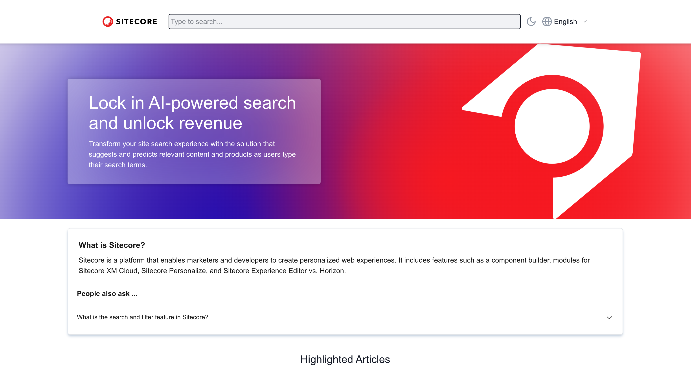
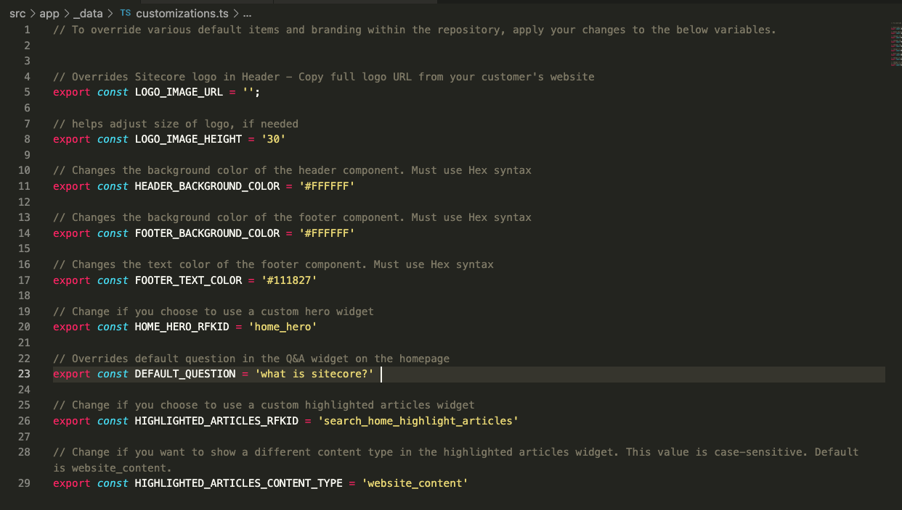
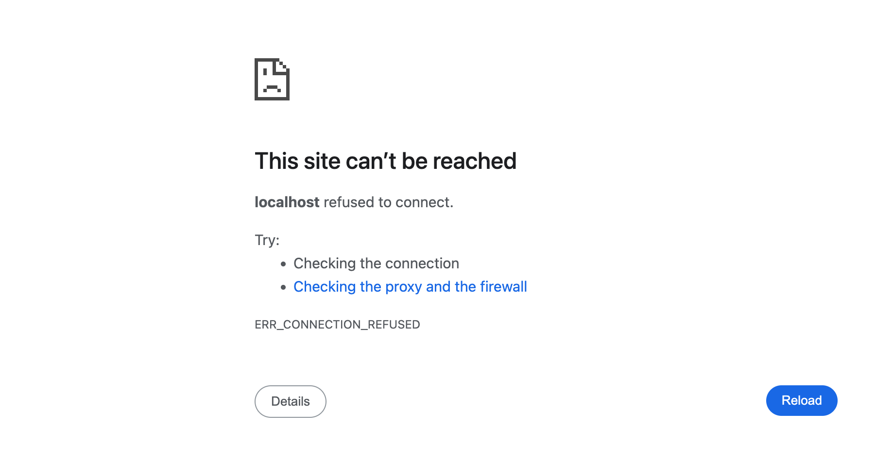
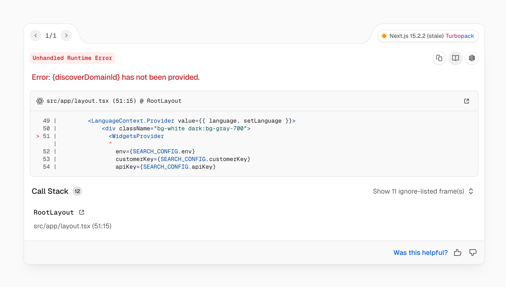

# SE Search Demo Starter Kit

Welcome! This repository is used for custom sitecore Search demos within the SE organization. It is built on NextJs and leverages the [Sitecore Search JS SDK for React](https://doc.sitecore.com/search/en/developers/search-js-sdk-for-react/introduction-to-sitecore-search-js-sdk-for-react.html).

## Table of contents
- [Prerequisites](#prerequisites)
- [CEC Setup](#cec-setup)
- [Getting Started with a new project](#getting-started-with-a-new-project)
- [Customizing your Project](#customizing-your-project)
- [Running your Previously Created Project](#running-your-previously-created-project)
- [Troubleshooting](#troubleshooting)
  - [This Site Can't be Reached](#this-site-cant-be-reached)
  - [Error running package installation](#error-running-package-installation)
  - [Missing env File](#missing-env-file)

## Prerequisites

Before you begin, You must have the following installed on your computer:
- [VS Code](https://code.visualstudio.com/download) (Or another IDE of your choice)
- [Git](https://git-scm.com/)
- [NodeJS](https://nodejs.org/en/) (Recommend the latest version)

Other helpful links:
- [Command Line Cheat Sheet](https://github.com/WebDevStudios/CLI-Cheat-Sheet/blob/master/basic-commands.md) (Mac)
- [Command Line Cheat Sheet](https://www.stationx.net/windows-command-line-cheat-sheet/) (Windows)
- [GIT Cheat Sheet](https://education.github.com/git-cheat-sheet-education.pdf)
- - [Tailwind Cheatsheet](https://www.creative-tim.com/twcomponents/cheatsheet)

## CEC Setup

While not required, it is recommended to run through the [CEC setup](https://sitecore1.sharepoint.com/:fl:/g/contentstorage/CSP_767ac533-ba73-4b47-9e6b-d9c9bba230a8/ETYosfOL5LpHiId-S6Ke7FgBgVPUzVzmLFoI4vSsoxHF6g?e=3SkbQ2&nav=cz0lMkZjb250ZW50c3RvcmFnZSUyRkNTUF83NjdhYzUzMy1iYTczLTRiNDctOWU2Yi1kOWM5YmJhMjMwYTgmZD1iJTIxTThWNmRuTzZSMHVlYTluSnU2SXdxSEV0NjNGdTJpbEVpcWpJTGNOZDd3YUEyY0ZUVDhEelQ1cTZjZ1paZEpLSiZmPTAxM1BQWjM2UldGQ1k3SEM3RVhKRFlSQjM2Sk9SSjUzQ1kmYz0lMkYmYT1Mb29wQXBwJnA9JTQwZmx1aWR4JTJGbG9vcC1wYWdlLWNvbnRhaW5lciZ4PSU3QiUyMnclMjIlM0ElMjJUMFJUVUh4emFYUmxZMjl5WlRFdWMyaGhjbVZ3YjJsdWRDNWpiMjE4WWlGTk9GWTJaRzVQTmxJd2RXVmhPVzVLZFRaSmQzRklSWFEyTTBaMU1tbHNSV2x4YWtsTVkwNWtOM2RoUVRKalJsUlVPRVI2VkRWeE5tTm5XbHBrU2t0S2ZEQXhNMUJRV2pNMlVVSllVVUZTTjBGUlRVVmFSRXRIUWtnMU4xTkxVME0zVFVVJTNEJTIyJTJDJTIyaSUyMiUzQSUyMmE0ZWJhOTAwLWE4NDYtNGMzYi1hYjc0LTZlNWFiNjcyZTEyYiUyMiU3RA%3D%3D) instructions outlined in Loop before setting up your local demo app. Some of the instructions outlined below require having your RFKIDs ready.

## Getting Started with a new project

The following setup only needs to be run once per local project. It is recommended to create a new local project per customer demo. This allows you to prep for multiple search demos at a time without overriding any changes.

If you are trying to run a project that was previously created, follow the instructions in [Running your previously created Project](#running-your-previously-created-project)

These instructions take you through the process of using the default terminal built into VS code through the entire process. Although you can use any command-line interface you choose. Helpful links to command-line cheat sheet resources have been provided in the prerequisites section if you get stuck at any point.

**Clone the Local Repository**

Open VS Code and open the terminal by clicking **Terminal** in the top menu, then selecting **New Terminal**. This will open a terminal window at the bottom of the VS Code window.

Now, in the Terminal window, navigate to the folder where you want to save the project using the `cd` command (change directory). For example:
```bash
cd path/to/your/folder
```

Once in the correct directory, paste the following command and wait for the install to run

```bash
git clone https://github.com/SitecoreNA/Sitecore-Search-TS-SDK-Starter-Kit.git

# OR if you want to specify your own folder name. This is recommended for easier organization.
git clone https://github.com/SitecoreNA/Sitecore-Search-TS-SDK-Starter-Kit.git <your-folder-name>
```

Now, open the folder containing the cloned repository in VS Code by clicking `File > Open Folder`... and select the folder you just cloned. You should then see the files in the left-hand side panel.

**Install the Required Packages**

The next step is to install the required packages (dependencies) that the project needs to run. 

Make sure you're in the correct directory (where your project files are). You may still be in the parent directory in which case, use `cd your-folder-name` to navigate to the newly created folder. You can check your current directory by using the command `pwd`, for Mac users or `cd` for Windows users.

Install the required packages by running the following command:

```bash
npm i
```

**Create ENV file**

In the root of your new project folder, create an **.env** file, then paste the following environment variables inside.

```bash
NEXT_PUBLIC_SEARCH_ENV=prod
NEXT_PUBLIC_SEARCH_CUSTOMER_KEY=<INSERT CUSTOMER KEY>
NEXT_PUBLIC_SEARCH_API_KEY=<INSERT API KEY>
NEXT_PUBLIC_SEARCH_SOURCE=<INSERT SOURCE ID>
```

You will need to replace the **Customer Key** and **API Key** with the values from the Developer Resources section in the CEC domain you are leveraging. We are generally useing the domain called **Sales Engineering - AMS**.

The **Source ID** will be the RFKID generated for the source you indexed during the [CEC setup](https://sitecore1.sharepoint.com/:fl:/g/contentstorage/CSP_767ac533-ba73-4b47-9e6b-d9c9bba230a8/ETYosfOL5LpHiId-S6Ke7FgBgVPUzVzmLFoI4vSsoxHF6g?e=3SkbQ2&nav=cz0lMkZjb250ZW50c3RvcmFnZSUyRkNTUF83NjdhYzUzMy1iYTczLTRiNDctOWU2Yi1kOWM5YmJhMjMwYTgmZD1iJTIxTThWNmRuTzZSMHVlYTluSnU2SXdxSEV0NjNGdTJpbEVpcWpJTGNOZDd3YUEyY0ZUVDhEelQ1cTZjZ1paZEpLSiZmPTAxM1BQWjM2UldGQ1k3SEM3RVhKRFlSQjM2Sk9SSjUzQ1kmYz0lMkYmYT1Mb29wQXBwJnA9JTQwZmx1aWR4JTJGbG9vcC1wYWdlLWNvbnRhaW5lciZ4PSU3QiUyMnclMjIlM0ElMjJUMFJUVUh4emFYUmxZMjl5WlRFdWMyaGhjbVZ3YjJsdWRDNWpiMjE4WWlGTk9GWTJaRzVQTmxJd2RXVmhPVzVLZFRaSmQzRklSWFEyTTBaMU1tbHNSV2x4YWtsTVkwNWtOM2RoUVRKalJsUlVPRVI2VkRWeE5tTm5XbHBrU2t0S2ZEQXhNMUJRV2pNMlVVSllVVUZTTjBGUlRVVmFSRXRIUWtnMU4xTkxVME0zVFVVJTNEJTIyJTJDJTIyaSUyMiUzQSUyMmE0ZWJhOTAwLWE4NDYtNGMzYi1hYjc0LTZlNWFiNjcyZTEyYiUyMiU3RA%3D%3D).

**Start the App**

To run the application, you can use the following command in the terminal:

```bash
npm run dev
```

Open [http://localhost:3000](http://localhost:3000) with your browser to see the result.


  

## Customizing your Project

This application provides the essential components and functionality to run a search demo out of the box, and includes Sitecore branded default components.

To customize some of the branding elements as well as use your own widgets you may have built in the CEC, in your file explorer panel (not terminal) in VS code, find the **customizations.ts** file in `/src/app/_data/customizations.ts` and open it.



Here you will find variables which allow you to override some of the most common customizations. For example, changing the header logo or selecting your own Q&A default question.

To change the default links within the footer component, find the **footer.json** file in `/src/app/_data/footer.json` and open it. You can then swap out the links with examples from the customers website.

**For those who are more advanced with their coding skills**, feel free to adjust any of the components to your needs. For example, you may want to adjust the default header to be more in line with the customer's website header. 

## Running your Previously Created Project

Open VS code and your terminal. Navigate to your project directory in your command line using `cd path/to/your/folder`. 

**Helpful Hint** To quickly get started, open a VS Code window by dragging your project folder onto the VS code app icon on your computer. This should automatically open your project in VS code and start you at the proper location within your terminal.

If you've already gone through all the initial setup steps before, simply run `npm run dev` to start up your project going forward.

## Troubleshooting

Refer to your terminal and/or browser console for troublshooting errors

### This Site Can't be Reached

If you navigate to your [http://localhost:3000](http://localhost:3000) URL and see the following message:



Check that you are running your application properly within the terminal by running `npm run dev`

### Error running package installation

If you're hitting the following error message in your terminal when running the `npm i` command, you are most likely in the incorrect folder. The error path within the message will indicate the current folder you are in. 
 
```bash
npm error path /you/current/path/package.json
npm error errno -2
npm error enoent Could not read package.json: Error: ENOENT: no such file or directory, open '/your/current/path/package.json'
npm error enoent This is related to npm not being able to find a file.
```
Use `cd` to navigate to your repositories correct path on your computer.

**Helpful Hint:** You can check your current directory by using the command `pwd`, for Mac users or `cd` for Windows users. To automatically open your terminal to the correct path of your project, would be to fully close VS code, then reopen by dragging the folder onto the VS code app icon. This should automatically open your project in VS code and start you at the proper location within your terminal.

### Error Starting Application

If you're seeing the following message in your terminal when running the `npm run dev` command, make sure you have properly installed your application packages with `npm i`.

```bash
> search-sandbox@0.1.0 dev
> next dev --turbopack

sh: next: command not found
```

### Missing env File

If you're seeing the following error message when opening your local application in the browser, make sure you have properly created your `.env` file per the directions in the [Getting Started with a new Project](#getting-started-with-a-new-project) section and it is located in the root of your project folder.

